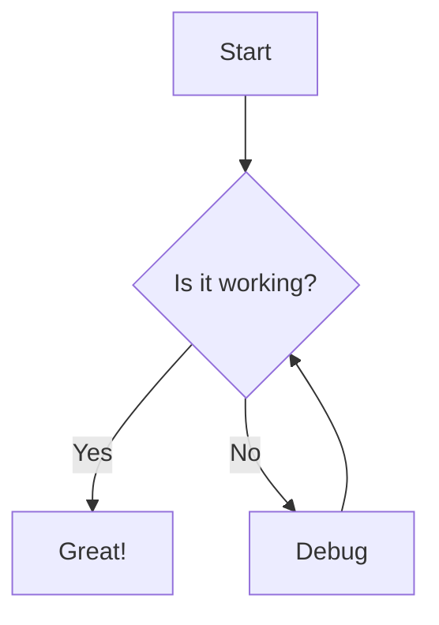

# VitePress Component Showcase

This page demonstrates the various components available in VitePress.

## Table of Contents

[[toc]]

## Custom Containers

VitePress provides several custom containers to highlight content:

::: info
This is an info box.
:::

::: tip
This is a tip.
:::

::: warning
This is a warning.
:::

::: danger
This is a dangerous warning.
:::

::: details Click me to view more
This content is initially hidden but can be revealed by clicking.
:::

## Badges

You can add badges to your text:

- Default badge <Badge text="default" />
- Tip badge <Badge type="tip" text="tip" />
- Warning badge <Badge type="warning" text="warning" />
- Danger badge <Badge type="danger" text="danger" />

## Code Groups

Code groups allow you to display multiple code blocks in tabs:

::: code-group

```js [JavaScript]
export default {
  data() {
    return {
      msg: 'Hello from JavaScript!'
    }
  }
}
```

```ts [TypeScript]
interface Data {
  msg: string
}

export default {
  data(): Data {
    return {
      msg: 'Hello from TypeScript!'
    }
  }
}
```

```python [Python]
def hello():
    return "Hello from Python!"
```

:::

## Aside Component

Regular content flows here.

::: aside
This is an aside that appears in the margin on larger screens.
:::

More regular content here.

## Custom Dividers

---

## Emoji Support

:smile: :rocket: :tada:

## Math Equations (if enabled in config)

Inline equation: $E = mc^2$

Block equation:

$$
\frac{d}{dx}e^x = e^x
$$

## Footnotes

Here's a sentence with a footnote[^1].

[^1]: This is the footnote content.

## Task Lists

- [x] Write the documentation
- [x] Add examples
- [ ] Publish the documentation

## Line Highlighting in Code Blocks

```js{1,3-5}
// This line is highlighted
console.log('Regular line')
// These lines are highlighted
const x = 100
console.log(x)
```

## Custom Containers with Titles

::: info Custom Title
This info box has a custom title.
:::

## Images with Captions


*This is an image caption*

## Diagrams with Mermaid (if enabled in config)



## Interactive Components (Vue Components)

<div class="demo-component">
  <!-- Vue components would go here if registered -->
  <p>This is where custom Vue components can be placed.</p>
</div>

<style>
.demo-component {
  padding: 20px;
  background-color: #f9f9f9;
  border-radius: 8px;
  margin: 20px 0;
  text-align: center;
}
</style>
